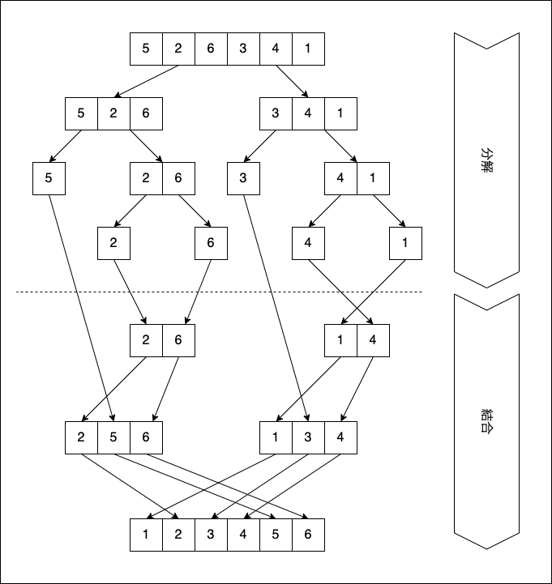
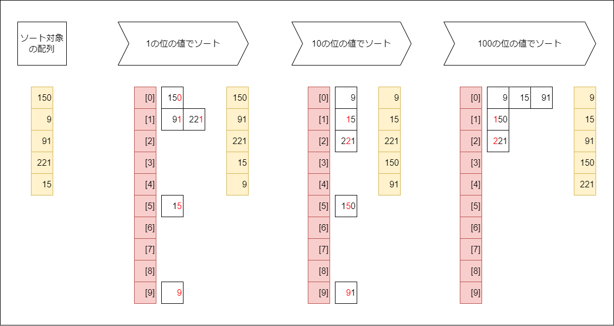

# 20220910-event-questions

**本リポジトリへの直接のプルリクエスト作成を防ぐため、リポジトリはアーカイブ状態としております**

## 概要

以下は、9/10(土)開催の「type就活フェア OB・OG座談会」に  
参加するために用意されたコーディング問題です。  
問題は2問ありますので、両問とも忘れずに解答してください。

## 問題

1. ソートアルゴリズムAの実装
2. ソートアルゴリズムBの実装

各問題の詳細は後述します。

## 解答例

[ソートアルゴリズムAの解答例はこちら](./answer/Q1_Sort/logic.py)  
[ソートアルゴリズムBの解答例はこちら](./answer/Q2_Sort/logic.py)

## 対応言語

対応言語は下記の8つです。

- Python3
- Java
- JavaScript
- C#
- Go

言語による採点結果への優劣はありませんので、得意な言語で挑戦してください。

## 採点基準

採点するにあたり、下記のルールは遵守しててください。ルールが守られていない場合は最低ランク評価となります。

1. 実行してエラーとならないこと
2. 正しい結果が得られること
3. 出題したアルゴリズムを利用して結果が得られていること
4. 解答導出に必要のない処理が書かれていないこと
5. 解答用テンプレートに記載のコメント「この中に解答を記述してください」と書かれたファイルにのみ記述をしてください

上記のルールを守った上で、下記の項目を満たす書き方の場合、高得点を獲得することができます。

6. メソッドや空行等で、コード量や処理の意味が適切に区切られていること
7. 読み手の理解しやすい順序で処理が書かれていること
8. 命名が適切であること
9. 記述が冗長でないこと
10. 読み手の理解を助けるコメントが書かれていること

## 評価ランク

上記の評価基準で採点してランク付けされます。

- Sランク：エース級プログラマー
  - 出題されたアルゴリズムを、リーダブルに実装できています
  - 今回のコーディングを意識しながら、色々な実装にチャレンジしてみてください
- Aランク：即戦力プログラマー
  - 出題されたアルゴリズムを、リーダブルに実装できています
  - S評価との差は、あとほんの少しの読み手への配慮だけです
- Bランク：期待の新人プログラマー
  - 出題されたアルゴリズムを実装できています
  - 複雑なアルゴリズムでも読みやすくコーディングできるようにチャレンジしてみてください
- Cランク：基礎習熟プログラマー
  - 出題されたアルゴリズムをある程度実装できています
  - 読み手に配慮したコーディングを意識してみましょう
- Dランク：駆け出しプログラマー
  - 要件に合うアルゴリズムが実装できていない、またはコードの可読性が低いです
  - まずは簡単なアルゴリズムから、読み手の理解しやすさを意識して書いてみましょう

## 解答方法

1. [typeshukatsuの問題リポジトリ](https://github.com/typeshukatsu/20220910-event-questions)をご自身の端末にクローンして、その後ご自身のGitHubアカウントに複製してください( [複製の方法はこちら](https://docs.github.com/ja/repositories/creating-and-managing-repositories/duplicating-a-repository#mirroring-a-repository) )
    - リポジトリ名は元のリポジトリ名 "20220910-event-questions" としてください
    - Branch protection rulesは設定をしないでください（採点できなくなる可能性があります）
1. 上記のリポジトリの可視性をプライベートに変更してください ( [可視性の変更方法はこちら](https://docs.github.com/ja/repositories/managing-your-repositorys-settings-and-features/managing-repository-settings/setting-repository-visibility#changing-a-repositorys-visibility) )
1. 複製したリポジトリで新たなブランチを作成してください。ブランチ名は任意のもので結構です ([ブランチの作成方法はこちら](https://docs.github.com/ja/pull-requests/collaborating-with-pull-requests/proposing-changes-to-your-work-with-pull-requests/creating-and-deleting-branches-within-your-repository))
1. 作成したブランチで、解答を作成してください
    - 解答はtemplateとして用意された各言語のファイルに記述してください
      - Pythonで解答する際の例:
        - Q1の解答を書き込むファイル: `template/Q1_Sort/python/logic.py`
        - Q2の解答を書き込むファイル: `template/Q2_Sort/python/logic.py`
      - 解答する言語のバージョンに関して特に指定はありません。ご自身の実行環境で動作するバージョンを使って解答してください。但し、
        - Pythonは2系ではなく3系を使用してください（3系の中でのバージョン指定はありません）
        - 解答は「この中に解答を記述してください」の中のみに記述を行うものとし、それ以外の箇所は修正しないでください
1. 解答後、解答をしたブランチから **mainブランチに対して** プルリクエストを作成してください ([プルリクエストの作成方法はこちら](https://docs.github.com/ja/pull-requests/collaborating-with-pull-requests/proposing-changes-to-your-work-with-pull-requests/creating-a-pull-request))
    - titleにはイベント申し込み時のメールアドレスを入力してください
    - commitメッセージは採点対象外です。任意の文字列を入力してください
    - descriptionは記載不要です
1. ご自身のリポジトリに、採点用アカウントをコラボレータ追加してください ([コラボレータ登録方法はこちら](https://docs.github.com/ja/account-and-profile/setting-up-and-managing-your-personal-account-on-github/managing-access-to-your-personal-repositories/inviting-collaborators-to-a-personal-repository))
    - ご自身と採点用アカウントのみが、そのリポジトリを閲覧できるようになります
    - 採点用アカウント名: "typeshukatsu" で検索してください
    - コラボレータ招待を以て解答完了とみなし、採点を行います
      - 採点開始の時点で、以後の解答変更を防止するためにmainブランチへのマージを行います
      - レビュアー設定後の解答内容の修正は原則認められません
    - 選考結果は結果に関わらず、9月3日(土)までにメールでお送りいたします
      - プルリクエスト上での採点フィードバック等は行いません

## 問題

### 問題１：ソートアルゴリズムAの実装（[解答用テンプレート](/template/Q1_Sort)）
- 整数の配列を昇順にソートするアルゴリズムを実装してください
- ソート対象の配列は「1つ以上の要素を持つ、ランダムに並べられた重複のない整数の配列」です
- ただし、以下の条件を満たすアルゴリズムを用いて実装してください
  - 配列を中央で分割します
    - 各要素が一つになるまで再起的に分割を繰り返します
  - 分割した要素の先頭同士を比較し、ソートしながら再起的に結合します

[問題1の解答例はこちら](./answer/Q1_Sort/logic.py)  

処理の参考イメージ  

### 問題２：ソートアルゴリズムBの実装（[解答用テンプレート](/template/Q2_Sort)）
- 整数の配列を昇順にソートするアルゴリズムを実装してください
- ソート対象の配列は「1つ以上の要素を持つ、ランダムに並べられた重複のない最大N桁の整数の配列」です
- ただし、以下の条件を満たすアルゴリズムを用いて実装してください
  - 一の位、十の位、百の位、、、10の(N-1)乗の位と、小さい桁から順番にソートします
  - テンプレートの変数'MAX_DIGITS'の値(N)を変更するだけで、他の桁数にも対応できるように実装してください

[問題2の解答例はこちら](./answer/Q2_Sort/logic.py)

処理の参考イメージ  

問題は以上です。  
